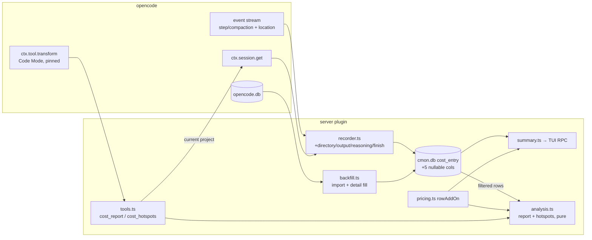

# Design

## Context

See `proposal.md` for motivation. Current state that shapes the approach:

- `cost_entry` (schema `user_version = 3`) stores per step/compaction: ids, agent, provider/model, kind, failed, opencode's `cost_micros`, input/cache-read/cache-write tokens, `created_at`, source. `Store.migrate` refuses a newer `user_version` by throwing. `index.ts` then logs and returns early, so tracking is off in that process.
- The TUI total comes from `summaryInputs` (SQL sums) plus `buildSummary`, which adds a per-row **cache-write add-on** for Copilot Claude rows (`pricing.ts`). `complete=false` means that some candidate row had unknown tokens or no price.
- History is imported once (`runBackfill`, marker). The token fill (`runTokenFill`) runs on every start for rows whose `tokens_cache_write IS NULL`, and writes zeros for rows that are absent from the source.
- Plugin runtime facts, checked against the opencode v2 source (`packages/core/src/{state,tool}.ts`, `tool/runtime.ts`, `codemode/*`, `schema/src/{tool,session,location}.ts`, generated client types):
  - Tools are added only through `ctx.tool.transform(cb)`; there is no `ctx.tool.add`. The State **replays every registered callback on each rebuild**, which any registration or reload in the tool domain triggers. A callback that throws **disables the plugin's whole registration group**. The returned `Registration` is also finalised automatically when the plugin scope closes.
  - `Tool.Context` = `{sessionID, agent, messageID, id, progress}` (+ `signal` in the promise API).
  - `Options`: `codemode` (default on) puts a tool in the Code Mode catalog behind `execute`. `pinned: true` always lists it inline in that catalog. `codemode: false` makes it a direct tool definition sent with **every** model request. A tool is hidden only by a wholly-deny permission rule on its name/permission. Code Mode tools are also hidden when `execute` is denied.
  - Model-visible result: a direct tool returns `content`, or `JSON.stringify(output)` when `content` is empty. Inside Code Mode the script receives `output` when one is declared, otherwise the text of `content`.
  - `ctx.session.get({sessionID})` returns `SessionInfo` with **`location.directory`** (not a top-level `directory`), `parentID?`, `subpath?`. Step events carry an optional envelope `location?: {directory}`. `session.step.ended.data` has `finish` and `tokens.{input,output,reasoning,cache.{read,write}}`.
  - Assistant messages in `opencode.db` have an optional `$.error` (schema `Session.Message.Assistant.error`).

## Goals / Non-Goals

**Goals:**
- Store output/reasoning tokens, finish reason and directory per row. Unknown is NULL and never zero.
- Two read-only agent tools over the existing ledger, with bounded output.
- **Invariant:** a `cost_report` total for a calendar month with no filters equals the TUI summary total for that month.
- Older plugin versions keep working against the upgraded file, and rollback needs no manual step.

**Non-Goals (design-level):**
- Step duration (dropped from the proposal: no hotspot uses it).
- Dollar "saving" estimates. Findings report the cost attributable to a pattern, a suggestion text and the formula behind it.
- Changing the SQL path that feeds the TUI. It only switches to the shared per-row add-on function.
- A `directory`/project group-by, an index on `parent_session_id`, and a prefix-match session filter (see YAGNI).

## Decisions

### D1. Schema evolution: additive columns without bumping `user_version` (option b)

| Option | Effect on an older (v3) plugin that starts after the upgrade | Rollback | Cost |
|---|---|---|---|
| (a) bump to 4 | throws in `migrate`, tracking silently disabled until all processes are upgraded | needs a manual `PRAGMA user_version=3` | none |
| (b) keep 3, ensure columns via `PRAGMA table_info` | works; ignores the new columns, which stay NULL on its rows | free | one table_info read per start |
| (c) bump to 4 + "min reader version" in meta | does not help v3 code that is already released, which checks only `user_version` | as (a) | new mechanism |

**Choice: (b).** The concern here is old processes being silently disabled, and (b) avoids it at negligible cost. A v3 process ignores unknown columns. Rows it writes have NULL details, and the detail fill (D4) picks them up on the next v4-capable start.

New rule for the store: `user_version` changes only for **incompatible** changes. Additive nullable columns are ensured idempotently. On every start, `migrate` reads `table_info` and, if any expected column is missing, adds the missing ones in an immediate transaction that re-reads `table_info` first.

New nullable columns: `tokens_output`, `tokens_reasoning`, `finish` (TEXT), `directory` (TEXT), `details_checked` (INTEGER, terminal marker, see D4). The `cost-recording` spec's "upgrade to 3 / refuse newer" requirement changes accordingly: newer versions are still refused, and additive columns no longer bump the version.

### D2. Live recording: directory and details

- `CostEvent` gains an optional `location?: {directory?: string}` (the event envelope).
- `RecorderDeps.resolveParent` becomes `resolveSession(sessionID) → {parentId, directory}`. It is one `ctx.session.get` call reading `parentID` and `location.directory`, cached per session as today.
- Row directory = envelope `location.directory` ?? session lookup ?? NULL.
- `finish` is set from `session.step.ended` only. It is NULL for `step.failed` and for compactions (`step.failed` can carry `finish: "content-filter"`, but `failed=1` already covers it).
- `tokens_output` / `tokens_reasoning` come from the event's `tokens`. NULL when absent, never 0-filled.
- `upsertLive` COALESCEs all new columns, as it already does for tokens. A live row is written with `details_checked = 1` only when `tokens_output` and `directory` are both known. Otherwise the fill gets one attempt.

### D3. History import (`completeBackfill`) maps the new fields directly

The source facts were verified by the caller: `$.tokens.{output,reasoning}`, `$.finish`, `session_v2.directory`.

- `failed` for steps is **corrected** to `$.error IS NOT NULL`, instead of always false.
- `finish` is taken only when `$.error IS NULL`, mirroring the live rule.

Imported rows get `details_checked = 1`.

### D4. Detail fill: own predicate and a terminal state

`runDetailFill` replaces `runTokenFill`'s role for the new columns. The existing token fill and its zero semantics stay unchanged, because the summary depends on them.

- Pending = `details_checked IS NULL AND created_at >= cutoff`. Most rows are pending exactly once.
- The source read is outside the cmon lock and chunked, the same as today. It joins `session_message` by id and `session_v2` by `session_id`.
- Per row in a successfully read chunk:
  - set output/reasoning/finish where the source has them; directory from `session_v2`;
  - for `source='backfill'` steps, also correct `failed` from `$.error`;
  - set `details_checked = 1` **even when the message is absent**, so values stay NULL and the row is not re-queried.
- The guard in the UPDATE is `details_checked IS NULL`, so concurrent fills apply once. It never overwrites a non-NULL value (COALESCE). A read failure writes nothing, and the next start retries.

### D5. Tool registration

- Registered in `setup` after the store opened (a failed open returns early, so no tools exist). The call is `ctx.tool.transform(editor => { editor.add(report); editor.add(hotspots) })`.
- The callback is **pure and non-throwing**. It adds two tool objects built once in `setup`, because a throw would disable all of this plugin's registrations. Replays are therefore idempotent: `add` with the same effective name overwrites.
- `execute` closes over this setup's `store` and `lookup`. On reload the old plugin scope closes, its transform is removed, and the new setup registers new closures. A Code Mode snapshot that is still in flight can call an old `execute` after disposal. Each `execute` therefore checks a `closed` flag and throws `Tool.Error("cost tracking stopped")`.
- Shutdown order: abort loop → **`await toolRegistration.dispose()`** → RPC dispose → `closed = true` → `store.close()`.
- Options: **`{ namespace: "cmon", pinned: true }`** (Code Mode default).

| Option | Per-request cost to every agent | Visibility |
|---|---|---|
| `codemode:false` (direct) | both JSON schemas on every model request, so this plugin itself raises every session's cost | all agents not denying the tool |
| Code Mode, `pinned` | one catalog line each; schemas fetched on demand | all agents with `execute` allowed |
| Code Mode, unpinned | ≤ pinned | may drop out of the inline listing under the 2 000-char budget |

**Choice: pinned Code Mode.** A cost tool that adds input tokens to every step works against its own purpose. Caveat (recorded as a risk): an agent whose permissions deny `execute` will not see the tools. No permission gate is added, per the user.

- Results return both `output` (structured, declared output schema) and `content` (compact text). Code Mode scripts see `output`, and direct callers see `content`. They carry the same facts.

### D6. "Project" filter semantics

- `project` input: omitted = all projects; `"current"` = the calling session's `location.directory` (via `ctx.session.get`, **not** `ctx.location`, which is the plugin's instance location); or an absolute path.
- Match = exact directory **or a path-boundary descendant**: `directory = $p OR substr(directory, 1, length($p) + 1) = $p || '/'`. `$p` is normalised (no trailing slash; `/` stays `/`). Using `substr` instead of `LIKE` avoids `%`/`_` escaping.
- Justification: a repo root then covers its subdirectories and in-repo worktrees (this repo uses `.worktrees/<name>`). Exact matching remains the special case. `"current"` from inside a worktree matches only that worktree, and the tool description says so.
- Rejected: `projectID`. It is not in the event envelope `LocationRef`, and the backfill source column is unverified. Re-evaluate if worktrees outside the repo tree become common.
- Rows with NULL directory are excluded under any project filter, and the count and cost of excluded rows (`excludedUnknownDirectory`) are reported.

### D7. Shared pricing: one per-row add-on function, two aggregators

Options:

1. Generalise the SQL aggregation (`GROUP BY <dim>` plus candidate rows keyed by group).
2. Load filtered rows (narrow columns) and aggregate in TS, sharing only the per-row add-on.
3. Move the TUI summary onto the TS path too.

**Choice: 2.** Hotspots need per-row and per-session detail anyway (top steps, input growth, fan-out), so the SQL `GROUP BY` from option 1 would still need a second path. Option 3 changes TUI behaviour and performance, which is out of scope.

Sharing: extract from `buildSummary` a pure `rowAddOn(row, catalog) → { micros } | { unknown: "tokens" } | { unknown: "price", key }` into `pricing.ts`. `buildSummary` and the analysis module both call it, so there is one rounding per row and the same `complete` semantics.

The invariant is enforced by a test that, for the same fixture rows and catalog, asserts `analysis` month total == `buildSummary` total. `complete` keeps its current meaning.

### D8. Tool API

Both tools have the same input core:

| Field | Meaning |
|---|---|
| `period` | `"month"` (default, current local month via `time.ts`) · `"YYYY-MM"` · `"<N>d"` (last N×24 h, 1 ≤ N ≤ 184) · `"YYYY-MM-DD..YYYY-MM-DD"` (local days, inclusive) |
| `agent`, `model`, `provider` | exact-match filters |
| `kind` | `"step"` \| `"compaction"`, a **filter**, not a group-by |
| `session` | exact session id; `includeSubagents` (default true) adds all descendants via a recursive CTE over `parent_session_id` |
| `project` | D6 |
| `limit` | default 10, hard max 50 (report) / 30 (hotspots) |

`cost_report` adds `groupBy` (`agent` default, `model`, `provider`, `session`, `day`; day = local date) and `sort` (`cost` default, `steps`, `avgCost`). For each group it returns:

- cost, share
- steps, avg cost per step
- tokens {input, output, reasoning, cacheRead, cacheWrite}
- cacheReadRatio = cacheRead / (input + cacheRead + cacheWrite); null when that sum is 0 or the provider/model never reports cache reads
- failedCost

It also returns totals, `complete`, and notes.

Period is half-open `[from, to)` in local time. When `from < retentionCutoff(now)`, the output says data before the cutoff was pruned and gives the effective start.

### D9. Hotspot findings

Every finding has: `type`, `scope` (session/agent/model id), `evidence` (metric, value, threshold), `attributableCost`, `share` of period total, `suggestion` (text or null), `basis` (formula/assumption). Findings are ranked by `attributableCost`.

Attributable costs **overlap** across findings and must not be summed; the output says so. All thresholds are named constants in `analysis.ts`.

| type | Detection | Attributable cost |
|---|---|---|
| `top_session` | top sessions by cost (subtree included) | session subtree cost |
| `top_step` | most expensive single rows | row cost incl. add-on |
| `low_cache_read` | per session: cacheReadRatio < `LOW_CACHE_READ_RATIO` and input+cacheRead ≥ `MIN_CACHE_TOKENS`; only provider/model pairs with any cacheRead > 0 in the retention window | cost of those rows |
| `cache_write_spend` | rows with cacheWrite > 0 | Copilot add-on micros; token count only for other providers |
| `failed_steps` | `failed = 1` | their cost (history corrected by D3/D4) |
| `truncated_steps` | `finish = 'length'` | their cost |
| `compaction_spend` | `kind = 'compaction'` | their cost |
| `subagent_fanout` | root session with ≥ `FANOUT_MIN_CHILDREN` descendant sessions (recursive) | descendants' cost |
| `input_growth` | session with ≥ `GROWTH_MIN_STEPS` steps: (input+cacheRead) of last step ÷ first step ≥ `GROWTH_RATIO` | session step cost |
| `agent_model_mix` | fact only: per agent, model share and avg output tokens/step | none, `suggestion: null` |

Error sources stated in `basis`:
- **Fan-out:** `parent_session_id` is NULL when the parent lookup failed, so the child is counted as a root.
- **Growth:** compaction resets context and lowers the ratio.

### D10. Output bounds

- Rows beyond `limit` fold into one `others` row, so shares sum to 100 %.
- `content` is a compact aligned text table: money via `money.ts`, full session ids (needed for follow-up `session` filters), message ids shortened to their last 8 chars (informational only).
- Hard ceiling of 8 KB / 120 lines on `content`, ending in `… truncated`.
- Notes always include:
  - "title-generation cost is not tracked"
  - retention truncation, when it applies
  - `excludedUnknownDirectory`, when a project filter is set
  - `complete=false` explained as "Copilot Claude cache-write cost missing for N rows"

The tool **description** states USD, the period grammar, the project matching rule and that title generation is not tracked.

### Diagram

### YAGNI rejections

- Duration column: no consumer.
- Savings estimate: not a fact, and its assumptions cannot be verified.
- Project group-by: the filter covers the stated need.
- `parent_session_id` index: recursion depth is small and the table is bounded by retention.
- Prefix match on session ids: full ids are shown.
- Moving the TUI summary onto the TS path: out of scope.
- Permission gate: excluded by the user.
- Tool-call attribution: out of scope.

## Risks / Trade-offs

- Agents that deny `execute` cannot see the tools → documented in the README. Switching to `codemode:false` is a one-line change if users ask for it, at the cost of per-request tokens.
- Loading a 6-month period into memory for analysis is slow on a large ledger → select narrow columns, filter in SQL on the indexed `created_at`, and run hotspots only for the requested period.
- Thresholds are heuristic (the user accepted "let's try it") → they are named constants and every finding shows its evidence and threshold, so a wrong threshold shows up as wrong findings rather than as wrong numbers.
- `failed` correction depends on `$.error` being present in stored assistant messages. That is verified in the schema, **not** in data → if absent, history stays under-counted as before. A test fixture covers both cases.
- Directory caching per session ignores `session.move` → the envelope location is preferred, and the cache is only the fallback.
- Envelope `location.directory` is assumed to equal the session's `location.directory` → unverified. Both are directory strings of the same `LocationRef` type, and the project match tolerates subdirectories.
- An old v3 process writes rows without details → they are filled on the next start of the new version. Between starts the project filter excludes them and counts them as unknown.

## Migration Plan

1. Release. The first start of the new version adds the missing columns (idempotent, immediate lock), runs the existing token fill, then the detail fill.
2. Processes that are already running keep working and their rows are filled later.
3. Rollback: install the previous version. `user_version` is still 3, so it opens normally and ignores the extra columns. No manual step.
4. Docs: README tool section. `AGENTS.md` "No agent tools" needs a one-line update through `agent-engineer`.

## Behavioural requirements implied (for delta specs)

- `cost-recording`:
  - the five nullable columns
  - unknown stays NULL
  - finish only from `step.ended`
  - directory precedence (envelope → session → NULL)
  - COALESCE on redelivery
  - additive columns no longer bump the version; newer versions are still refused
- `cost-retention`:
  - import maps the new fields and corrects `failed` from `$.error`
  - the detail fill is terminal per row, keeps NULL for absent data, and is idempotent under concurrency
- `cost-analysis`:
  - D5–D10 inputs, outputs, bounds and notes
  - the month-total invariant with the TUI
  - no tools when the store failed to open
  - tool errors after shutdown

## Component breakdown

| Part | Kind of work | Done when |
|---|---|---|
| Store schema + column ensure + upsert/insert/fill queries + filtered row query (incl. subtree CTE, project match) | application code (TS/SQLite) | store tests cover: column add on v3 file, a v3 process can still open the file, COALESCE, terminal fill, project boundary match |
| Recorder directory/details | application code | recorder tests cover: envelope vs session fallback, finish only on ended, NULL tokens |
| Backfill import mapping + detail fill | application code | tests against fixture `opencode.db` for present/absent/error messages; no re-query after terminal state |
| `rowAddOn` extraction | application code (refactor) | summary tests unchanged and passing |
| `analysis.ts` (period parsing, aggregation, hotspots) | application code, pure | unit tests per finding type, `others` row, invariant test against `buildSummary` |
| `tools.ts` + `index.ts` wiring | application code | idempotent transform, dispose on shutdown, closed guard, no tools when store fails; output within the ceiling |
| README + spec deltas | docs | tools, period grammar, project rule, `execute` caveat documented |
| `AGENTS.md` line | instruction file | updated by `agent-engineer` |
