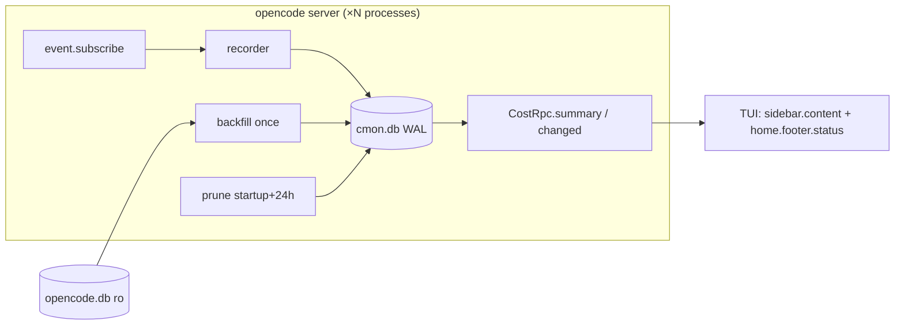

# Design

## Context

See proposal.md for the why and the scope. Facts the design relies on (all checked against opencode v2.0.20 source):

- Server plugins get `ctx.event.subscribe({signal})`, `ctx.rpc.register`, `ctx.session.get`, `ctx.storage`. TUI plugins get the slots `sidebar.content` (`{sessionID}`) and `home.footer.status` (`{}`), plus `storage.store(key, default)` for persisted UI state.
- Event payloads:
  - `session.step.started {sessionID, assistantMessageID, agent, model{providerID,id}, started}`
  - `session.step.ended {sessionID, assistantMessageID, finish, cost, tokens}`
  - `session.step.failed {sessionID, assistantMessageID, error, cost?, tokens?}`
  - `session.compaction.started {inputID?, reason, …}`, `session.compaction.ended {model, cost, tokens, …}`, `session.compaction.failed {inputID?, cost?, tokens?, …}`
- The compaction message ID is `inputID ?? eventID.replace(/^evt_/, "msg_")` of the **started** event (`SessionMessage.ID.fromEvent`). `ended`/`failed` keep the ID of the running message.
- `opencode.db`'s `event` table only holds legacy V1 data. Backfill reads `session_message` (`type` ∈ `assistant`, `compaction`; JSON `data` with `agent`, `model`, `cost`, `tokens`, `time`, `error`, `status`) joined to `session_v2` to get `parent_id`.
- Reference implementation: `opencode-todo` (bun:sqlite store with WAL and `busy_timeout`, `user_version` migrations, `Rpc.define` with a pull method and a `changed` event, a TUI with a safety-net poll, and `tsc` plus `script/build-tui.mjs` building to `dist/`).

## Goals / Non-Goals

**Goals:** recording that is correct and never counts a step twice when several opencode server processes share one `cmon.db`; a one-shot backfill; a TUI that reflects new cost within seconds; pure, unit-testable logic.

**Non-Goals:** tokens columns, per-model UI, history views beyond the current month, live sync between server processes (the safety-net poll covers that), any write to `opencode.db`.

## Decisions

### D1 Module layout (mirrors opencode-todo)

| Module            | Responsibility                                                                                                                                                                                        |
| ----------------- | ----------------------------------------------------------------------------------------------------------------------------------------------------------------------------------------------------- |
| `src/index.ts`    | Server plugin `setup`. Opens the store, registers the RPC, runs backfill then prune, starts the 24 h prune timer, starts the event loop. Cleanup aborts the loop, clears the timer and closes the DB. |
| `src/store.ts`    | Schema, migrations, `recordLive` (upsert), `recordBackfill` (insert-or-ignore, many), `summary(from,to)`, `prune(cutoff)`, meta get/set, `revision`.                                                  |
| `src/recorder.ts` | Pure state machine that turns an event into `Row \| null`. Holds the per-message and per-session state described in D3. It does no I/O; the parent lookup is passed in.                               |
| `src/backfill.ts` | Opens `opencode.db` read-only, runs the query, maps rows (same mapping rules as the recorder).                                                                                                        |
| `src/time.ts`     | `retentionCutoff(now)` and `localMonthRange(now)`. Pure functions that take the timezone from the process.                                                                                            |
| `src/money.ts`    | `usdToMicros` (`Math.round(usd * 1e6)`) and `formatUsd(micros)` → `$12.34`.                                                                                                                           |
| `src/rpc.ts`      | `CostRpc` contract (D5).                                                                                                                                                                              |
| `src/tui.tsx`     | Both slot components and the shared hook that fetches and refreshes data.                                                                                                                             |

Paths: `$XDG_DATA_HOME/opencode` (default `~/.local/share/opencode`) for both `cmon.db` and `opencode.db`. Plugin options `dbPath` and `sourceDbPath` override these, mainly for tests.

### D2 Schema (`user_version = 1`)

```sql
CREATE TABLE cost_entry (
  id TEXT PRIMARY KEY,              -- assistant / compaction message id
  session_id TEXT NOT NULL,
  parent_session_id TEXT,           -- NULL = top-level session
  agent TEXT NOT NULL,
  provider_id TEXT NOT NULL,
  model_id TEXT NOT NULL,
  kind TEXT NOT NULL CHECK (kind IN ('step','compaction')),
  failed INTEGER NOT NULL DEFAULT 0,
  cost_micros INTEGER NOT NULL,
  created_at INTEGER NOT NULL,      -- epoch ms, UTC
  source TEXT NOT NULL CHECK (source IN ('live','backfill'))
);
CREATE INDEX cost_entry_created_at ON cost_entry(created_at);
CREATE TABLE meta (key TEXT PRIMARY KEY, value TEXT NOT NULL);
```

Pragmas on open: `journal_mode=WAL`, `busy_timeout=5000`, `synchronous=NORMAL`. The store refuses to open a DB whose `user_version` is newer than it knows (same rule as opencode-todo). Rejected for YAGNI: token columns, a sessions table, per-month rollup tables. One indexed range scan over at most about 6 months of rows is cheap.

### D3 Event → row mapping (`recorder.ts`)

The recorder keeps in-memory state, all of it lost on restart:

- `steps: Map<assistantMessageID, {agent, model, started}>`, set on `step.started` and deleted on `step.ended`/`step.failed`.
- `lastAgent` and `lastModel`, both `Map<sessionID, …>`, updated on every `step.started`.
- `compactions: Map<sessionID, {id, started}>`, set on `compaction.started`.

| Event               | Row                                                                                                                                                    |
| ------------------- | ------------------------------------------------------------------------------------------------------------------------------------------------------ |
| `step.ended`        | `id=assistantMessageID`, kind `step`, agent and model from `steps` (fallback `lastAgent`/`lastModel`, then `"unknown"`), `created_at = started ?? now` |
| `step.failed`       | as above with `failed=1`. Emit a row **only if** `cost != null && tokens != null`, otherwise drop it.                                                  |
| `compaction.ended`  | `id` from `compactions` (fallback `fromEvent(event.id)`), kind `compaction`, model from the event, agent = `lastAgent(session) ?? "compaction"`        |
| `compaction.failed` | `id = inputID ?? compactions.id`, model = `lastModel`, same cost/tokens rule as `step.failed`                                                          |

The agent comes from the step, never from the parent session, so sub-agent sessions are naturally attributed to their own agent. The parent comes from `ctx.session.get(sessionID).parentID`, cached per session ID. If the lookup fails, `parent_session_id` is NULL and the row is still written. Writes use `INSERT … ON CONFLICT(id) DO UPDATE`, so live data wins over backfilled data and a redelivered event does nothing harmful. After every write `revision` is bumped and `changed` is emitted.

Compaction agent alternatives considered: the literal `"compaction"` only, or attributing to the parent session's agent. Chosen: the session's last step agent. That is the agent whose context was compacted, so the cost belongs to it. `"compaction"` is only the fallback.

### D4 Backfill and prune

```mermaid
sequenceDiagram
  participant P as server process (each of N)
  participant S as opencode.db (read-only)
  participant C as cmon.db
  P->>C: read meta.backfill_done
  alt not done
    P->>S: SELECT session_message ⨝ session_v2 WHERE created >= cutoff
    S-->>P: rows (mapped in memory)
    P->>C: BEGIN IMMEDIATE
    P->>C: re-check meta.backfill_done
    P->>C: INSERT OR IGNORE rows; meta.backfill_done = now
    P->>C: COMMIT
  end
  P->>C: DELETE WHERE created_at < cutoff  (startup, then every 24h)
```

- Source rows are read **outside** the write lock, so the `IMMEDIATE` transaction only does inserts and stays short. The marker is re-checked inside the lock, so of two processes starting together only one inserts. The other blocks on `busy_timeout`, then sees the marker and skips. Both may read the source, which is harmless.
- Mapping uses the same rules as D3: `assistant` rows give a step (drop failed rows that lack cost or tokens), `compaction` rows with `status` ∈ `completed`/`failed` give a compaction. A compaction row's agent is the agent of the newest preceding assistant row in the same session, falling back to `"compaction"`. `created_at = data.time.created`.
- Fail-soft: if the schema doesn't match or the source can't be opened (missing table or column, JSON shape mismatch), log a warning and do **not** set the marker, so the next start retries. `SQLITE_BUSY` after the timeout is handled the same way. The plugin keeps recording live costs either way.
- `retentionCutoff(now)` = `now` shifted back 6 calendar months in local time (`Date#setMonth(m-6)`). Backfill and prune share it.
- Prune is a single `DELETE` that is idempotent and safe to run concurrently. It runs after backfill at startup and then every 24 h on an `unref`'d interval, which is cleared in cleanup. If rows were deleted, `revision` is bumped.

### D5 RPC contract (`CostRpc`, id `cmon`)

- `summary({from, to})`, with epoch ms bounds `[from, to)`, returns `{revision, totalMicros, agents: [{agent, micros}]}` sorted by `micros` desc then `agent`. The query is `SUM(cost_micros) … GROUP BY agent` over the `created_at` index.
- Event `changed({revision})` tells the TUI to pull again.

The caller passes the range, which keeps the server free of timezone logic and makes the method a pure query. The alternative was a `month` argument resolved on the server. That was rejected because it ties the server's timezone to the TUI process and is harder to test.

### D6 Month boundary and timezone

`localMonthRange(now)` returns `[new Date(y, m, 1), new Date(y, m+1, 1))` in local time, as epoch ms. It is computed in the TUI on every fetch. Fetches happen on `changed`, on mount, and on a 60 s safety-net poll. The poll also picks up cost written by _other_ server processes and the month rollover at midnight. DST is handled because the `Date` local constructors are used and no fixed offsets are added.

### D7 TUI

A single shared hook `useMonthlyCost(context)` does the RPC pull, the `changed` subscription and the 60 s poll. The open/closed state lives in `context.storage.store("view", {open: false})` and is **shared** by both slots, so toggling in one place applies everywhere. A mouse click on the header line toggles the state, the same interaction as the collapsible opencode-todo sidebar.

`sidebar.content`, wrapped (default) and open:

```text
▸ This month: $12.34           ▾ This month: $12.34
                                 build        $8.10
                                 explore      $3.02
                                 general      $1.22
```

`home.footer.status` is a single line in both states, so it never grows the footer:

```text
▸ $12.34 this month
▾ $12.34 · build $8.10 · explore $3.02 · +1
```

Rules:

- Agents are sorted descending. The footer shows the top 2, then `+N`.
- Amounts are rounded to cents with `formatUsd`.
- If there are no rows, show `$0.00` and an empty breakdown.
- While loading, show `…` in place of the amount. If the RPC is unavailable or fails, show `—`. The block never throws into the host.
- Theme colours come from the TUI context, with no hard-coded colours. The secondary text in the breakdown uses the muted text token.

### D8 Testing (`bun test --conditions=browser`)

- `recorder.test.ts`: table-driven event sequences covering a normal step, a failed step with and without cost or tokens, a missing `step.started`, compaction ID derivation (with and without `inputID`), and a sub-agent session.
- `store.test.ts`: temp-file DB covering migrations, refusing a newer `user_version`, upsert precedence (live over backfill), summary bounds being `[from,to)`, and prune. It also covers concurrency: two `Store` instances on one file run backfill at the same time and the row count equals the source count.
- `backfill.test.ts`: a fixture `opencode.db` built with the minimal `session_message`/`session_v2` shape, plus a schema-mismatch fixture that should leave the marker unset and not throw.
- `time.test.ts`: month range and cutoff with `TZ` pinned (e.g. `Europe/Berlin`) across a DST boundary and the month boundary.
- `tui.test.ts`: same approach as opencode-todo, rendering both slots with a stubbed RPC client in the wrapped, open, loading and error states.

### D9 Packaging

Copy opencode-todo exactly:

- `package.json` `exports` `"."`, `"./rpc"`, `"./tui"`.
- Peer dependencies `@opencode/plugin >=2`, plus optional `@opentui/*` and `solid-js`.
- `build` = `tsc -p tsconfig.build.json && node script/build-tui.mjs`, writing to `dist/`. The vendored copy in ai-dotfiles loads from `dist/` (that follow-up is out of this repo).
- No runtime dependencies besides `bun:sqlite`.



## Risks / Trade-offs

- [Upstream changes the event payload or the ID scheme] → All event access goes through `recorder.ts` with fixture tests. Unknown shapes are dropped and logged, never thrown.
- [`session_message` schema drift] → Backfill is fail-soft and retried each start. Live recording is unaffected.
- [Plugin starts mid-step, so `step.started` was missed] → Fall back to the session's last agent, then `"unknown"`. This only affects steps that were in flight at startup.
- [Rows from other processes are invisible until a poll] → A 60 s poll is enough for a monthly figure. Cross-process notification was rejected for YAGNI.
- [Floating-point rounding] → Values are converted to integer micro-USD once at ingest. Sums are exact integers.
- [Backfill lock held while 6 months are inserted] → Inserts are batched in one transaction with prepared statements, which is expected to finish in under a second. `busy_timeout` 5 s with fail-soft retry covers outliers.

## Migration Plan

New plugin with no migration of existing data. Enabling it creates `cmon.db` and runs the backfill once. Rollback: disable the plugin and optionally delete `cmon.db`. `opencode.db` is never written.
