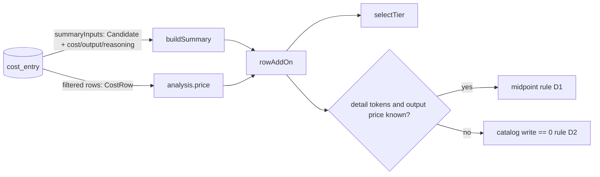

# Design: per-row cache-write add-on decision

## Context

- opencode prices a step as `(input·in + (output+reasoning)·out + cacheRead·read + cacheWrite·write) / 1e6` on the tier chosen by context `input+cacheRead+cacheWrite` (`packages/core/src/session/usage.ts` `calculateCost`). `output` is *visible* output; reasoning is a separate count. Adding both does not count anything twice. Compaction rows use the same function.
- `selectTier` in `src/pricing.ts` already mirrors that tier choice.
- Today `cacheWriteExtraMicros` decides from the **reader's** catalog (`tier.cache.write === 0`). That catalog can differ from the one opencode used when it **recorded** the cost, so the decision is wrong. The proposal gives the evidence.
- `CostTier` / `parseTier` drop the `output` price today, and the heuristic needs it.
- `CostRow` already has `costMicros`, `outputTokens`, `reasoningTokens`. `Candidate` has none of them.
- The recorder writes `outputTokens`/`reasoningTokens` together (both null or both set). Backfill can fill them separately.

## Decisions

### D1. Decision rule: compare against the midpoint

For a row where `addOnApplies` holds and `cacheWrite > 0`, with tier `t = selectTier(...)`:

```
expected = input·t.input + cacheRead·t.cache.read + (output + reasoning)·t.output   // micro-USD, unrounded
addOn    = round(cacheWrite · 1.25 · t.input)
apply    = costMicros < expected + addOn / 2
```

The result is `addOn` if `apply` is true, else 0. The amount and the single rounding per row stay as they are today.

Options considered:

| Option | Verdict |
|---|---|
| **Midpoint between "excluded" and "included"** (chosen) | Gives the largest symmetric tolerance (±addOn/2) to price drift and rounding. Needs no tuning constant. Scales with each row. |
| Relative tolerance (e.g. recorded within 1 % of `expected`) | Rejected. A small cache write falls inside the tolerance either way, and a magic number would need tuning. |
| Continuous correction `max(0, addOn − (costMicros − expected))` | Rejected. Price drift would show up as fractional, hard-to-explain add-ons. A binary decision is easier to explain and to test. |
| Persist an "includes cache write" flag at record time | Rejected. The recorder cannot see which catalog opencode used, and it would need a schema change and backfill. The proposal rules both out. |

The comparison is between the integer `costMicros` and an unrounded float. The recorder's ±1 µUSD rounding matters only when `addOn < ~2 µUSD`, and then either outcome is negligible.

### D2. Fallback when the inputs to the rule are unknown

The rule needs `outputTokens !== null && reasoningTokens !== null` **and** a numeric `output` price on the selected tier. If either is missing, use the current catalog rule: apply when `t.cache.write === 0`.

Both token counts are required. An unknown reasoning count, treated as 0, would make `expected` too low. A real cache-write charge would then look like "already included" and the add-on would be wrongly suppressed. The missing-price case works the same way.

The fallback does **not** set `complete: false`. The row's cost is still the best available estimate, and the spec's "incomplete" meaning (unknown tokens or no price) stays as it is. Known gap: the original bug survives for these rows when the reader's catalog has write > 0. See the risks below.

Rows with `tokens === null` (unknown) and catalogs with no priced entry keep their current `unknown` outcomes. The spec requirement "Incomplete pricing is flagged" does not change.

### D3. Data shape

- `CostTier` gains `output: number | undefined`. `parseTier` reads `entry.output` when it is a number and otherwise leaves it undefined. It must still not reject a tier that has no output price.
- `Candidate` gains `costMicros: number`, `outputTokens: number | null`, `reasoningTokens: number | null`. The names match `CostRow`, so both types fit the same parameter type structurally.
- `store.summaryInputs` candidate query adds `cost_micros, tokens_output, tokens_reasoning` to its column list. The **WHERE filter does not change**: rows with `tokens_cache_write = 0` still produce no add-on, and NULL still means unknown. No index or schema change.

### D4. One code path

`rowAddOn(row, catalog)` stays the only entry point. Its `row` parameter widens to `{ providerId, modelId, tokens, costMicros, outputTokens, reasoningTokens }`. `cacheWriteExtraMicros` takes the same detail fields (or `rowAddOn` takes over its logic). `buildSummary` (`src/summary.ts`) passes `Candidate`, and `price()` (`src/analysis.ts`, ~L144) passes `CostRow`, so neither caller needs changes. Do not copy the rule into either caller.



## Behavioural requirements implied (for the engineer to transcribe into the delta spec)

- Change "Totals include the cache-write add-on": the add-on applies when the recorded cost is below `expected + addOn/2` (D1). It falls back to "selected tier prices cache writes at zero" only when output or reasoning tokens, or the tier's output price, are unknown (D2).
- Scenarios to add or replace:
  - The October regression: a row recorded at 1,238 µUSD with 123,430 µUSD of cache-write add-on gets the add-on, **even though the catalog prices cache writes above zero**.
  - A row whose recorded cost already includes the cache write gets 0.
  - The unknown-output fallback.
- The existing "Summary shows the corrected figure" (cost 100,000, add-on 50,000) and "No add-on outside the rule" (the "tier already prices writes above zero" clause) scenarios need token data or a new wording that fits D1.
- The sidebar total and `cost_report`/`cost_hotspots` agree for the same rows and catalog.
- "Incomplete pricing is flagged": unchanged.

## Failure modes

| Failure | Effect | Blast radius / recovery |
|---|---|---|
| Catalog price changed between recording and reading by more than addOn/2 | Wrong decision for that row: ±1 add-on | One row. Rows with large writes have wide margins, and rows with small writes produce small errors. Self-corrects when the catalog matches again. |
| A provider starts billing cache writes at a price ≠ 1.25·input | Midpoint still decides correctly whenever `cw·p_w > addOn/2` (p_w > 0.625·input) | None in practice. |
| Output/reasoning unknown (old or backfilled rows) and reader catalog write > 0 | Add-on silently missing, which is the original bug, limited to these rows | Bounded by how many such rows exist. See research needs. |
| Failed step rows | Same rule. If opencode recorded 0 cost with tokens present, the add-on applies | Consistent with the current behaviour for failed rows that have tokens. |
| Catalog tier lacks `output` | Fallback D2 | Row-local. |
| Empty catalog | Unchanged: `unknown/price`, reload, `~` total | Unchanged. |

## YAGNI rejections

- No configurable threshold: the midpoint needs no tuning.
- No per-row "decision reason" in the summary or RPC: nothing consumes it.
- No stored flag or migration (D1 table).
- No fix for why the sidebar's catalog differs (out of scope per the proposal).

## Component breakdown

| Part | Work kind | Done when |
|---|---|---|
| `pricing.ts`: `CostTier.output`, `parseTier`, `rowAddOn` / `cacheWriteExtraMicros` rule D1 + D2 | application code + unit tests | Tests cover: the regression row applies with catalog write > 0; an "included" row gives 0; the midpoint boundary (just below / at); unknown reasoning → fallback; missing output price → fallback; tiered row uses the tier's output price. |
| `types.ts` `Candidate`, `store.summaryInputs` columns | application code + store test | Candidates carry `costMicros`, `outputTokens`, `reasoningTokens`. The filter is unchanged. |
| `summary.ts` / `analysis.ts` | application code (type-only or none) + tests | Both go through `rowAddOn`. A shared fixture gives the same add-on in `buildSummary` and `cost_report`. |
| `cost-display` delta spec | spec authoring | Behavioural requirements above transcribed. `openspec validate` passes. |
